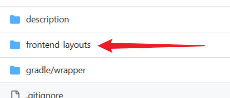
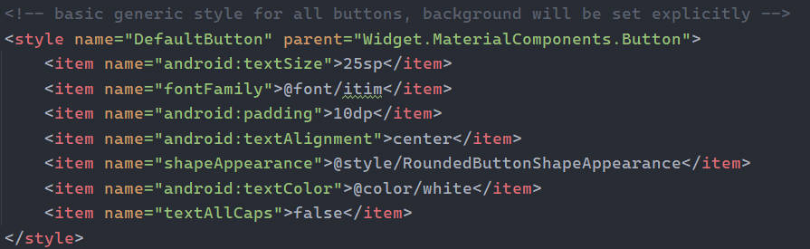
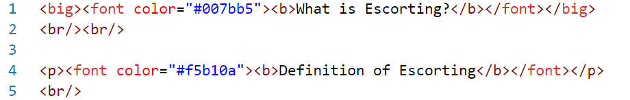
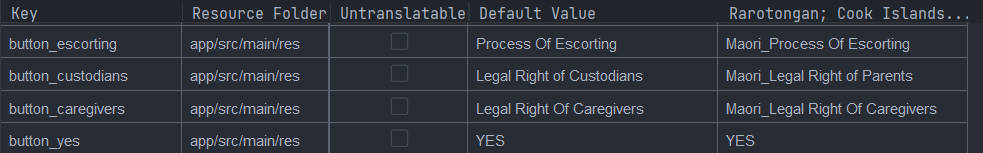
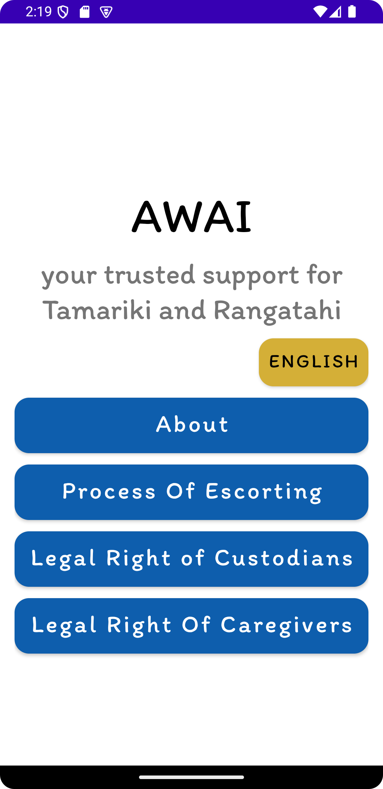
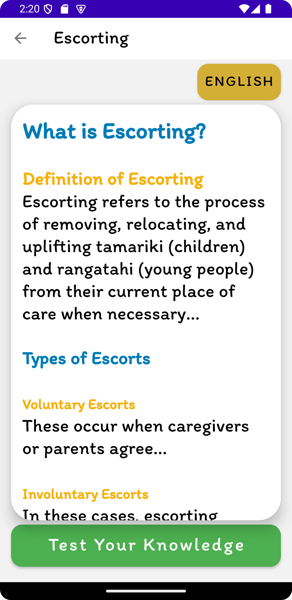
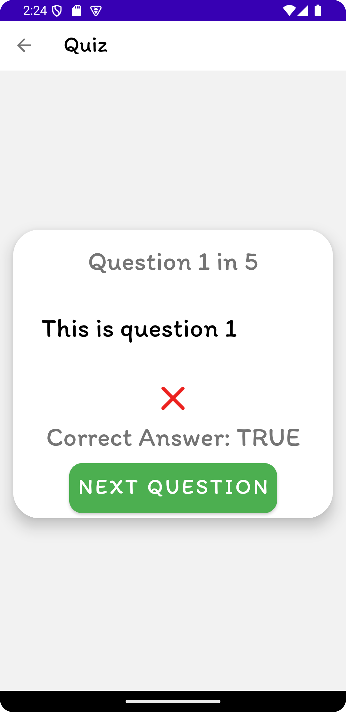
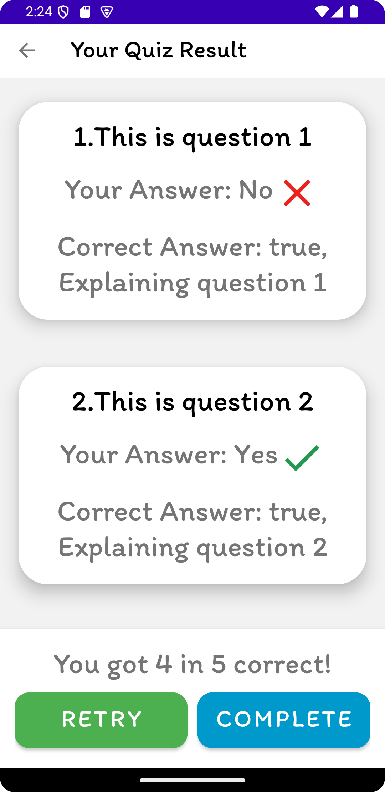

# Information App

## Team Work

**Frontend** 

XML layouts could be placed in `frontend-layout` directory, then I will cooperate them into project

Modify styles that referred from views in `theme.xml`

**Research** 

Upload Text file in `description` directory, better to have HTML file to specify color and size (only big and small for respectively 20% larger and smaller compared to normal size)

Modify references for every texts of views in`string.xml`, Then open Translation Editor

## TODO LIST

- [ ] Fill up contents
- [x] Stylize fonts, colors and backgrounds
- [x] Language buttons at other fragments
- [ ] Fix exception for language switching

## Update at 11-2

### COMPLETE

- Set up MVVM for quiz and result fragments
- Language button at Home Fragment (REMAIN: get life cycle exception)

## Update at 11-4

### COMPLETE

- Improve layouts structure
  - Colorful HTML paragraph
  - Card View layout
  - Better font
- Animate navigations

|  |  |  |  |
| ------------------------------------------------------------ | ------------------------------------------------------------ | ------------------------------------------------------------ | ------------------------------------------------------------ |

