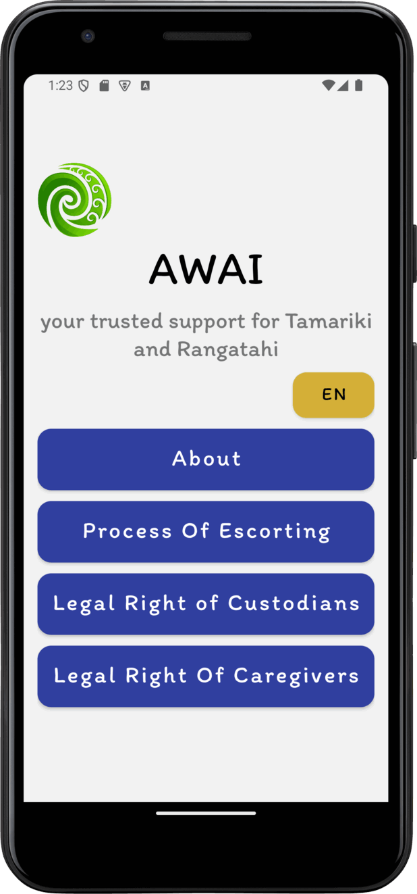
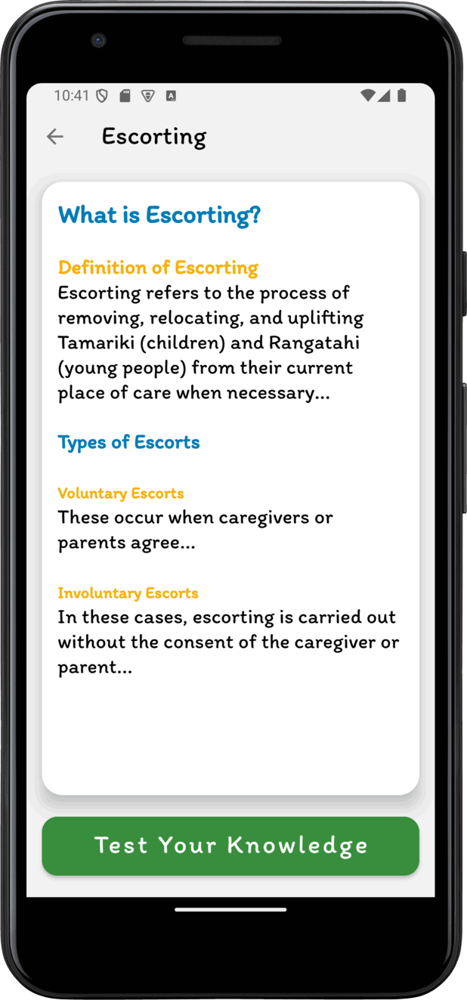
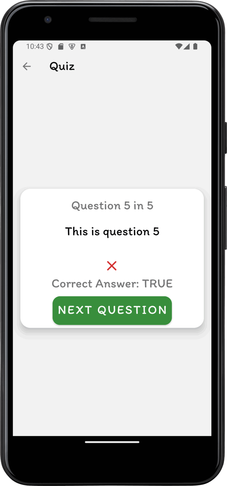
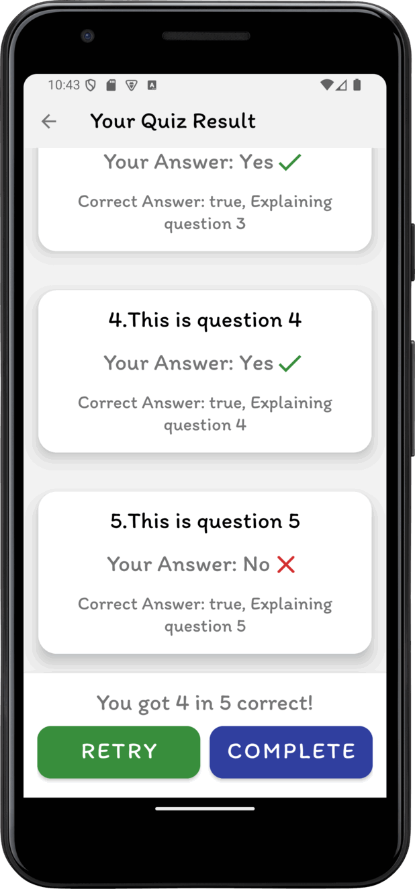

# Information App

The Information App for the prototype should cover Escorting Tamariki and Rangatahi. Escorting is the process of removing, relocating, and uplifting Tamariki and Rangatahi from their current place of care. 

### SCREENSHOT

|  |  |  |  |  |
| ------------------------------------------------------------ | ------------------------------------------------------------ | ------------------------------------------------------------ | ------------------------------------------------------------ | ------------------------------------------------------------ |

### [Demo Animation](description/demo_1104.gif)

Update on 11-4

### [Oranga Tamariki](https://practice.orangatamariki.govt.nz/policy/escorting-tamariki-and-rangatahi/) 

This site has a lot of unnecessary information therefore, you are advised to look for information under the sections provided. 

### [Community Law organization for NZ](https://communitylaw.org.nz/community-law-manual/chapter-13-dealing-with-oranga-tamariki-ministry-for-children/dealing-with-oranga-tamariki-ministry-for-children/) 

This site provides a lot of legal processes and advice; therefore you are advised to look for information under the sections provided that focus on escorting, but include information that could help and assist. 

## Features

### Information

1. What is Escorting? 
2. Types of Escorts? 

### The Process of Escorting

The following is a guideline for when escorting has been actioned. 
1. An assessment is made when the environment has been identified as a risk, meaning escorting is necessary. 
2. **Oranga Tamariki** becomes the custodians of children when escorting is in action. 
3. **Oranga Tamariki** are **NOT** custodians of children WHEN others have assumed responsibility. 
4. Escorting is authorized by someone in charge – also, provide information on the conditions. 
5. The Informed Escort Strategy and who it is provided to. 

### Legal Rights of Parents
Legal rights for parents shall refer to Escorting and/or the Escorting process, NOT legal rights in general. 

### Legal Rights of Caregivers
Legal rights for Caregivers shall refer to Escorting and/or the Escorting process, NOT legal rights in general. 

### Provision of this application

1.	**Target Audience:** Parents, Caregivers 
2.	Provide details and summarise information in the context of a mobile app. 
3.  Provide links for users for further information. 

## TODO LIST

- [ ] Research contents for paragraph, quiz, explanation
- [x] Stylize fonts, colors and backgrounds
- [x] Language buttons at other fragments
- [ ] Fix exception for language switching

## TEAM REMINDER

### Frontend 

- XML layouts could be placed in `frontend-layout` directory, then I will cooperate them into project

- Modify styles that referred from views in `theme.xml`

### Research 

- Upload Text file in `description` directory, better to have HTML file to specify color and size (only big and small for respectively 20% larger and smaller compared to normal size)

- Modify references for every texts of views in`string.xml`, Then open Translation Editor

## Update at 11-2

### COMPLETE

- Set up MVVM for quiz and result fragments
- Language button at Home Fragment (REMAIN: get life cycle exception)

## Update at 11-4

### COMPLETE

- Improve layouts structure
  - Colorful HTML paragraph
  - Card View layout
  - Better font
- Animate navigations

## Update at 11-5

### COMPLETE

- Persist data - language code - across lifecycle
- Better Language switching looks
- Add the Landscape layout for Home
- Modify the language button implementation
